# 🚀 NextStepCV – ATS Uyumlu CV Oluşturucu

**Modern. Sade. Özelleştirilebilir. Güvenli.**


NextStepCV, kullanıcıların adım adım CV oluşturmasına olanak tanıyan, karanlık tema destekli, PDF çıktısı alabilen ve Firebase ile tam entegre edilmiş modern bir özgeçmiş oluşturma uygulamasıdır.

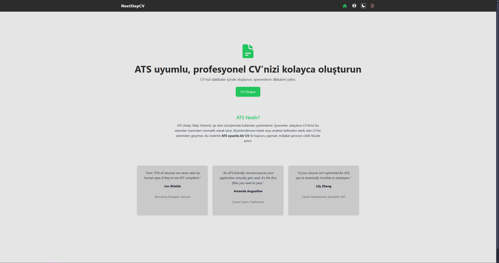

---

## 🌟 Özellikler

* ✅ Adım adım CV oluşturma (Temel Bilgiler, Eğitim, Deneyim, Projeler, vb.)
* 🎨 Aydınlık & karanlık tema desteği
* 📄 Şablon seçimi ve anında PDF çıktısı
* 🔐 Firebase Authentication ile güvenli giriş/kayıt
* ☁️ Firestore ve Storage ile canlı veri senkronizasyonu
* 🖼️ Profil fotoğrafı yükleme 
* 📱 Mobil uyumlu ve responsive tasarım
* ☁️ Netlify + Render ile full-stack canlı deploy

---

## 🔐 Canlı Sürüm

|Domain                |   [https://nextstepcv.tech](https://nextstepcv.tech)    |
| -------------------- | ------------------------------------------------------- |


| Platform              | Bağlantı                                                                           |
| --------------------- | ---------------------------------------------------------------------------------- |
| 🌐 Frontend (Netlify) | [https://nextstepcvapp.netlify.app](https://nextstepcvapp.netlify.app)             |
| 📈 Backend (Render)   | [https://nextstepcv-backend.onrender.com](https://nextstepcv-backend.onrender.com) |

> ⚠️ Not: Uygulama Firebase güvenlik kuralları ile korunmaktadır. Yalnızca kimliği doğrulanmış kullanıcılar kendi verilerine erişebilir.

---

## 🤝 İş Birliği & Yatırım Teklifleri

NextStepCV, potansiyeli yüksek modern bir ürün olarak geliştirilmeye devam etmektedir.  
Yatırım, stratejik ortaklık veya profesyonel iş birliği tekliflerinizi memnuniyetle değerlendiririz.

📬 İletişim: [chemie.valorant@gmail.com](mailto:chemie.valorant@gmail.com)


<!---
## ⚙️ Kurulum ve Geliştirme

### 1️⃣ Repo'yu klonlayın
```bash
git clone https://github.com/chemieai/nextstepcv.git
cd nextstepcv
```

### 2️⃣ Frontend kurulumu
```bash
cd client
npm install
```

### 3️⃣ Backend kurulumu
```bash
cd backend
npm install
```

.env dosyaları ve daha fazlası için proje içinde yer alan `.env.example` şablonlarına bakabilirsiniz.
-->

---

## 🗄️ Uygulama Ekran Görüntüleri

### 🔐 Giriş & Kayıt

| Login                                         | Register                                         |
| --------------------------------------------- | ------------------------------------------------ |
| 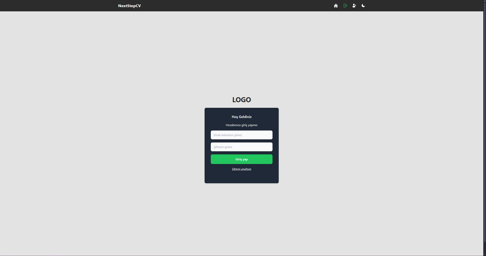      | 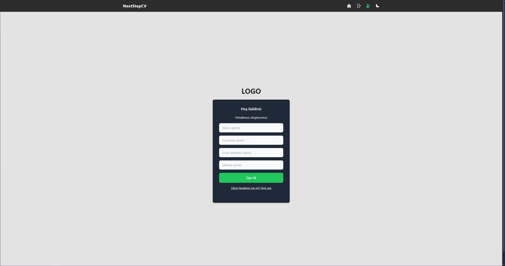      |
| 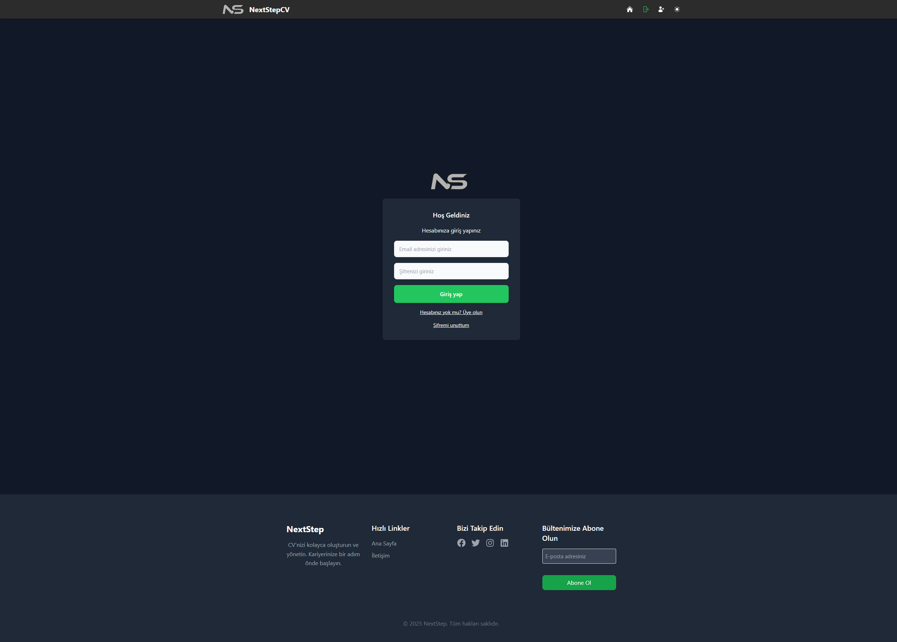 | 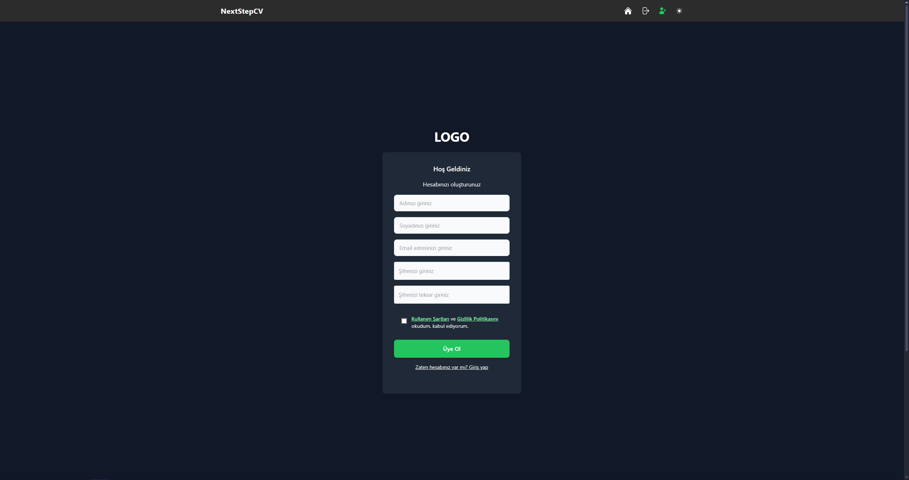 |

---

### 🏠 Ana Sayfa

| Light                                      | Dark                                            |
| ------------------------------------------ | ----------------------------------------------- |
|  | 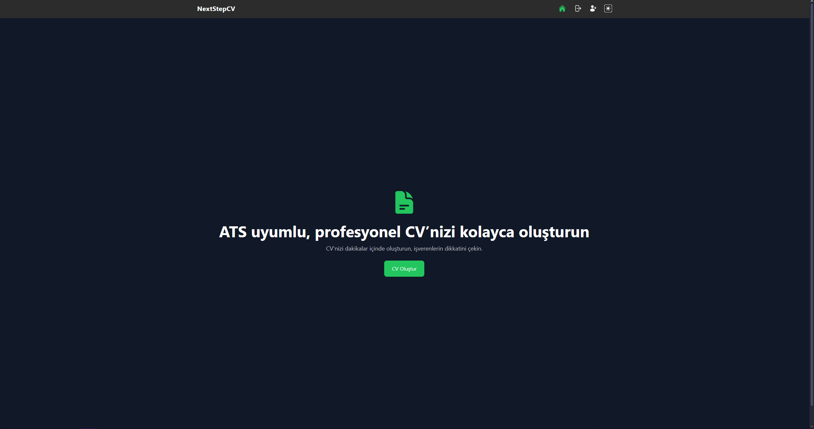 |

---

### 🏗️ CV Oluşturma Adımları

| Sayfa                                         | Karanlık Tema                                      |
| --------------------------------------------- | -------------------------------------------------- |
| 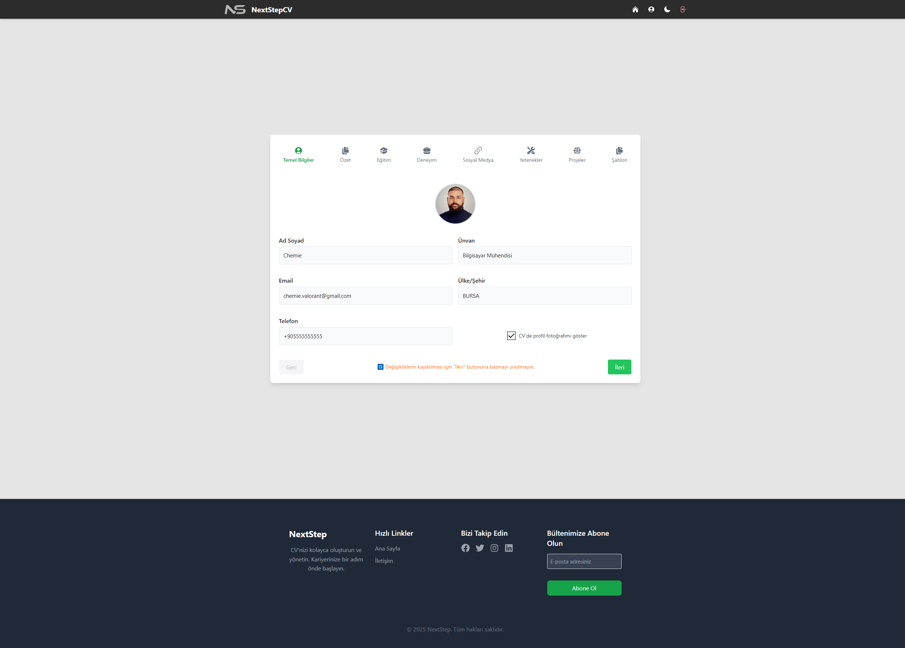 | 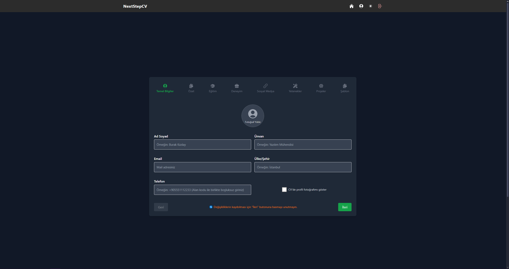 |

---

### 🔍 CV Önizleme & PDF

| Önizleme                                           | PDF                                            |
| -------------------------------------------------- | ---------------------------------------------- |
| 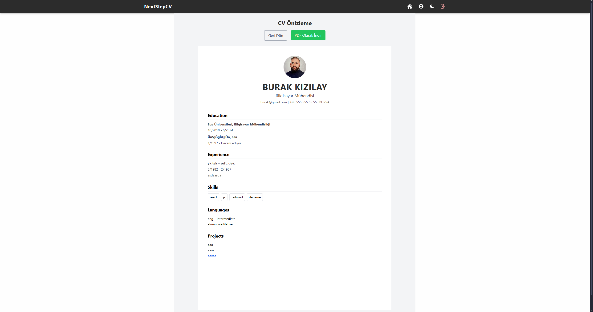      | 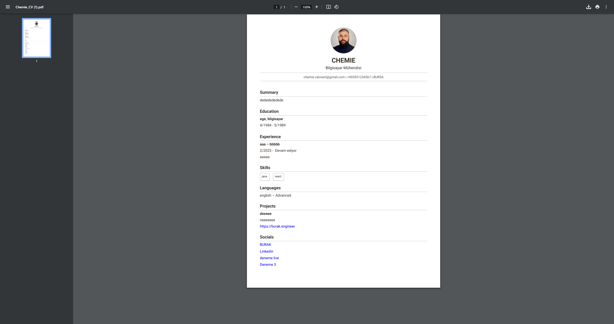 |
| 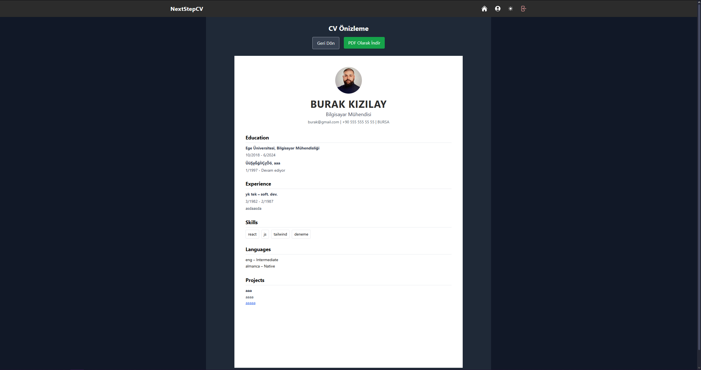 |                                                |

---

### 👤 Profil Sayfası

| Light                                      | Dark                                            |
| ------------------------------------------ | ----------------------------------------------- |
| 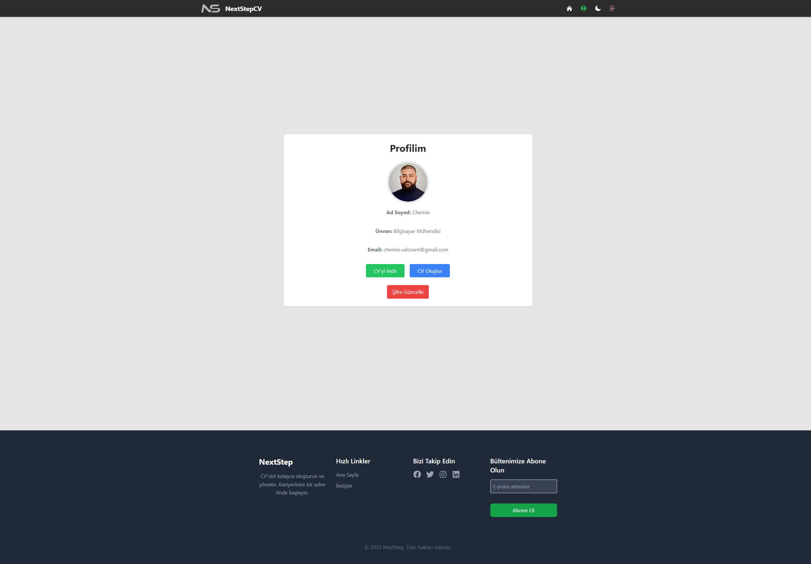 | 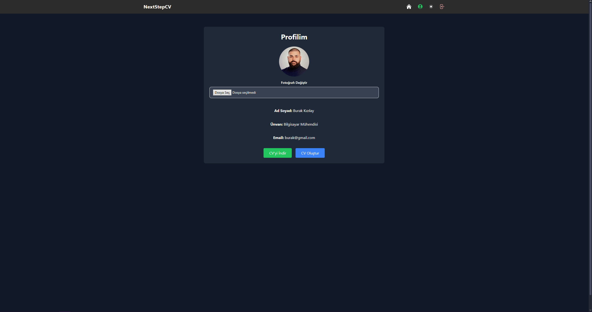 |

---

## 🛠️ Kullanılan Teknolojiler

* React.js + Vite
* Tailwind CSS
* Firebase (Auth, Firestore, Storage)
* React Router
* react-pdf / html2canvas
* Heroicons
* Netlify & Render deploy altyapısı

---

## 📄 Lisans

MIT License

---

> ✍️ Geliştiren: [Burak "Chemie" Kızılay](https://github.com/chemieai)
> ⭐️ Projeyi beğendiyseniz repo’ya ⭐️ bırakmayı unutmayın!

---

## 🤝 İş Birliği & Yatırım Teklifleri

NextStepCV, potansiyeli yüksek modern bir ürün olarak geliştirilmeye devam etmektedir.  
Yatırım, stratejik ortaklık veya profesyonel iş birliği tekliflerinizi memnuniyetle değerlendiririz.

📬 İletişim: [chemie.valorant@gmail.com](mailto:chemie.valorant@gmail.com)

