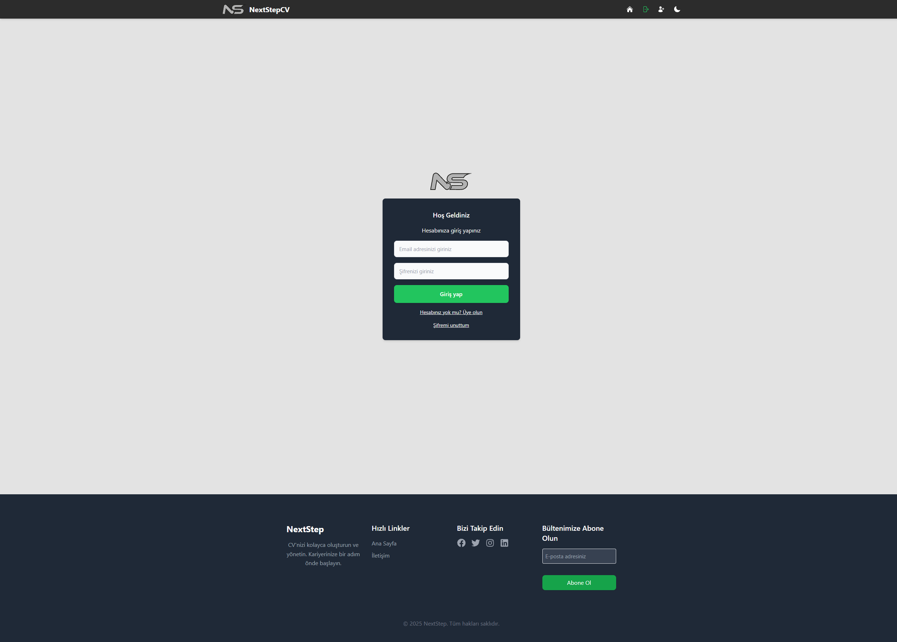
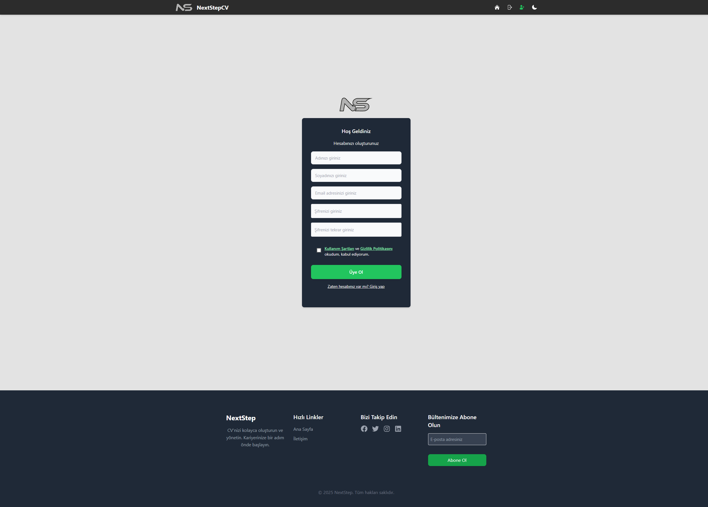
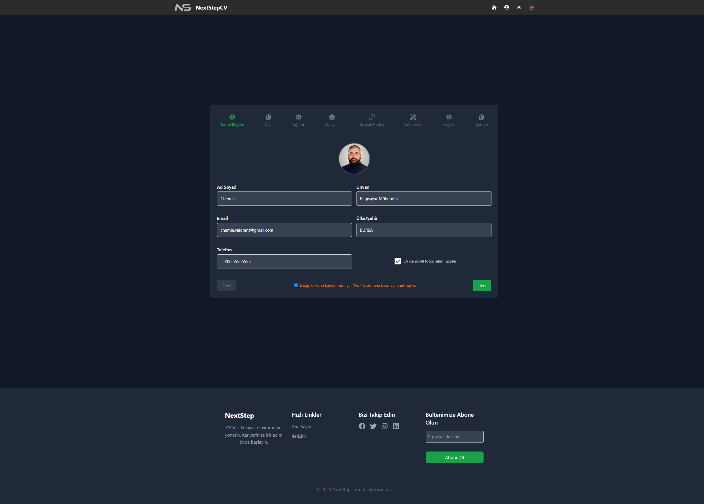
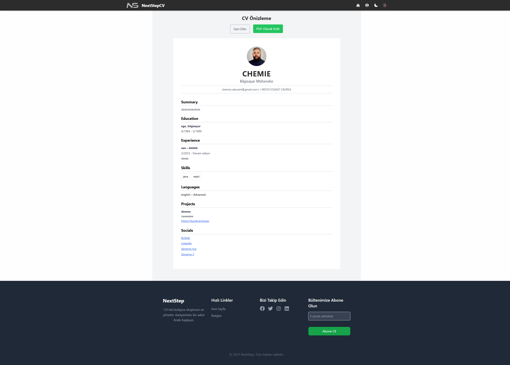
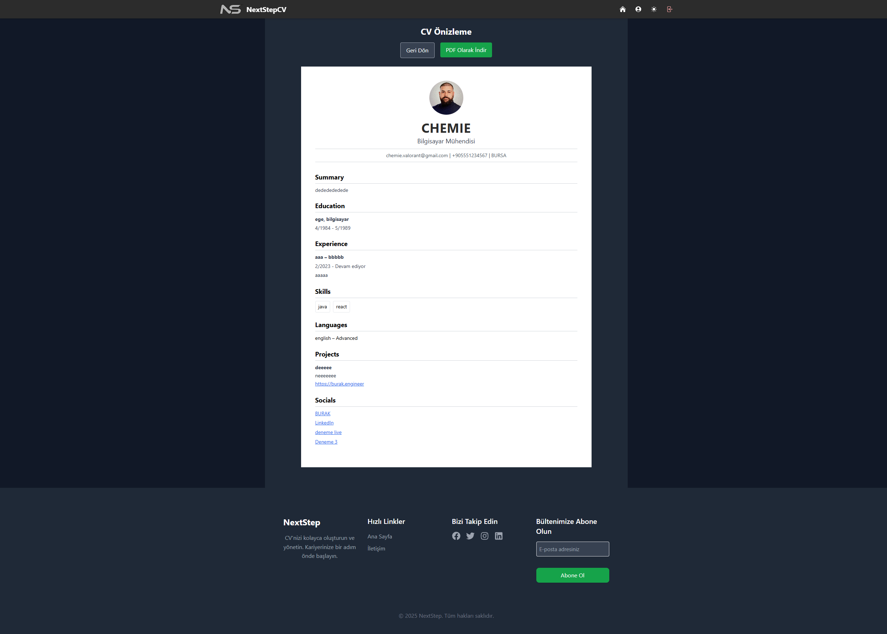

# NextStepCV 🚀

NextStepCV, kullanıcıların adım adım özgeçmiş oluşturmalarına olanak tanıyan modern, sade ve özelleştirilebilir bir CV oluşturma uygulamasıdır.


---

## 🔧 Kurulum ve Başlatma

### 1. Repository'yi Klonlayın
```bash
git clone https://github.com/chemieai/nextstepcv.git
cd nextstepcv
```

### 2. Bağımlılıkları Kurun
```bash
npm install
npm install -D tailwindcss postcss autoprefixer
npx tailwindcss init -p
npm install react-router-dom
npm install @heroicons/react
npm install @react-pdf/renderer
```

if you get error with tailwind
```bash
npm install -D @tailwindcss/postcss
```

### 3. Firebase Ayarlarını Yapın
`/src/firebase.js` dosyasındaki Firebase konfigürasyon bilgilerini kendi projenize göre doldurun.

### 4. Firebase Configuration
```bash
npm install -g firebase-tools
firebase login
firebase use --add
```
loginde hata alırsanız
#### 1.PowerShell'i Yönetici olarak çalıştırın:
  Başlat Menüsüne "PowerShell" yazın
  "Windows PowerShell" üzerine sağ tıkla > Yönetici olarak çalıştır seçeneğine tıklayın
#### 2.Aşağıdaki komutu çalıştırın:
```bash
Set-ExecutionPolicy -Scope Process -ExecutionPolicy Bypass
```
eğer yine de aşağıdaki gibi bir hata alırsanız 
```bash
Error: firebase use must be run from a Firebase project directory.
Run firebase init to start a project directory in the current folder.
```
aşağıdaki komutu çalıştırın:
```bash
firebase init
```
tüm kurulumu tamamladıktan sonra da
```bash
firebase deploy
```
yapmayı unutmayın

### 5. Backend kurulumu
```bash
mkdir backend
cd backend
npm init -y
npm install express cors dotenv firebase-admin
npm install multer
```

### 6. Uygulamayı Başlatın
```bash
npm run dev
```

---

## 🌟 Özellikler

- Adım adım CV oluşturma (Temel Bilgiler, Eğitim, Deneyim, vb.)
- Karanlık ve aydınlık tema desteği 🌗
- Şablon seçimi ve PDF çıktısı alma
- Firebase Authentication ve Firestore entegrasyonu
- Gerçek zamanlı veri kaydı

---

## 🖼️ Uygulama Görselleri

### 🔐 Giriş & Kayıt Sayfası
| Login | Register |
|-------|----------|
|  |  |
|  |  |

---

### 🏠 Ana Sayfa
| Light | Dark |
|-------|------|
|  |  |

---

### 🧑‍💼 CV Oluşturma Adımları
| Sayfa | Karanlık Tema |
|-------|---------------|
|  |  |

---

### 🔍 CV Önizleme & PDF
| Önizleme | PDF |
|----------|------|
|  |  |
|  |  |

---

### 👤 Profil Sayfası
| Light | Dark |
|-------|------|
|  |  |

---

## 🛠️ Kullanılan Teknolojiler

- React.js + Vite
- Tailwind CSS
- Firebase (Auth, Firestore, Storage)
- React Router
- react-pdf / html2canvas
- Heroicons

---

## 📄 Lisans
MIT License

---

> Geliştiren: Burak "Chemie" Kızılay | ⭐️ Projeyi beğendiyseniz repo'yu yıldızlamayı unutmayın!
